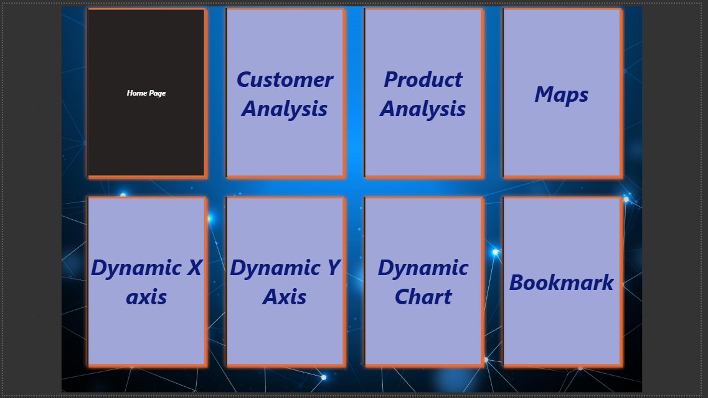
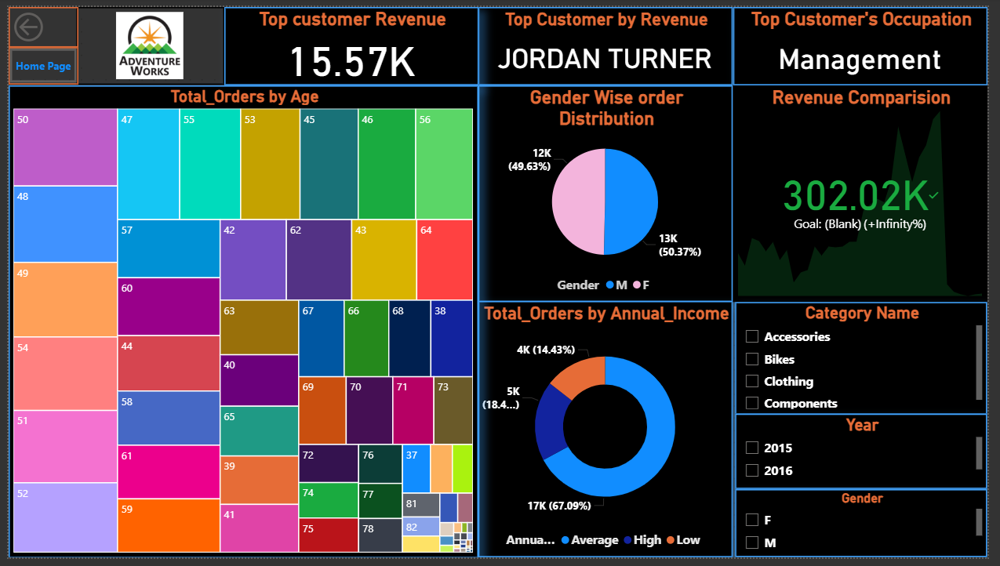
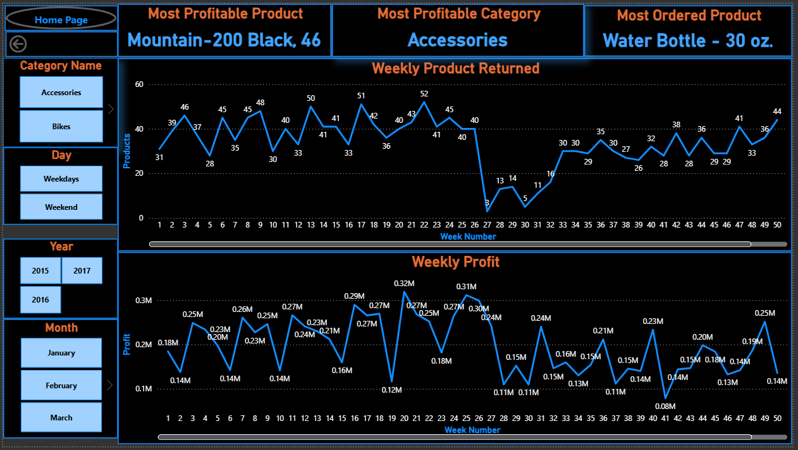
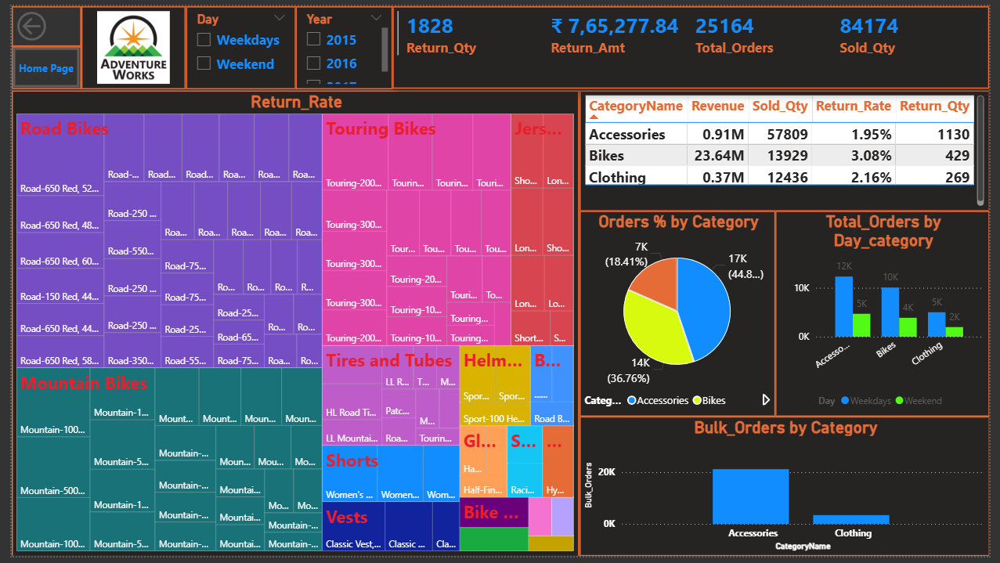
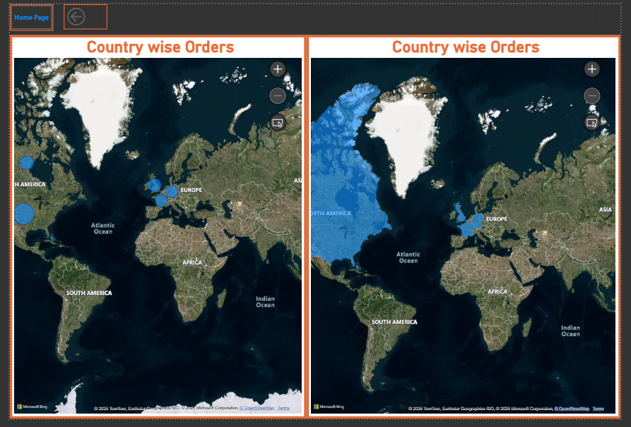
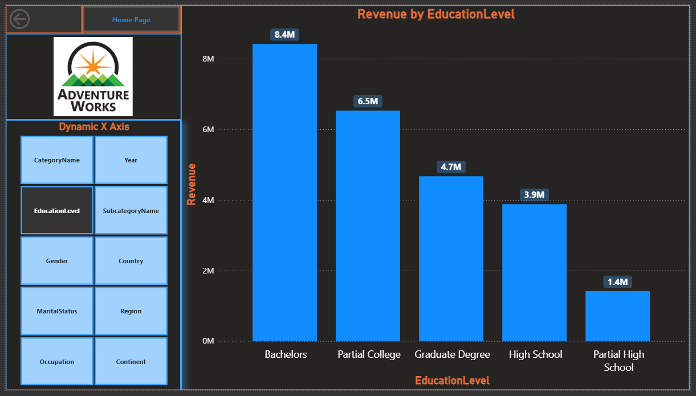
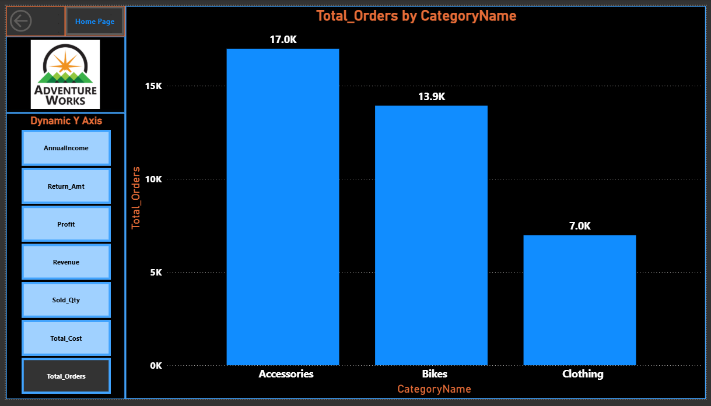
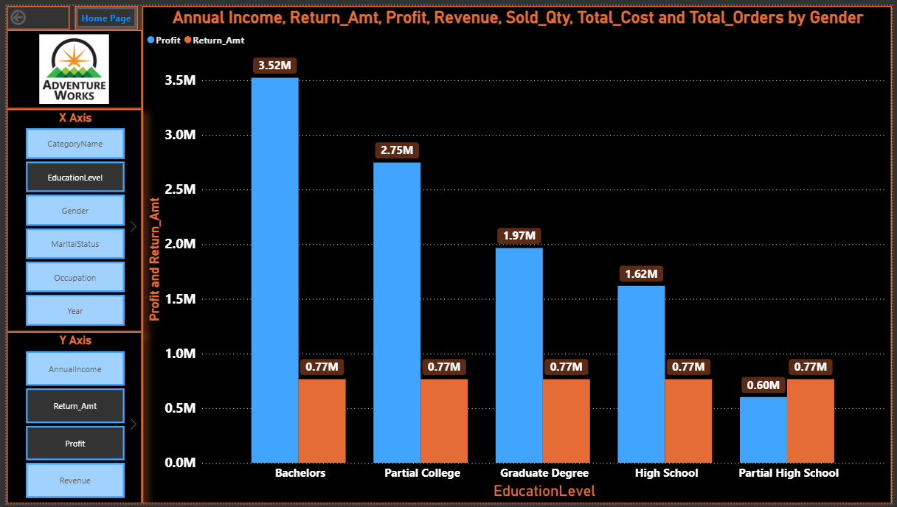
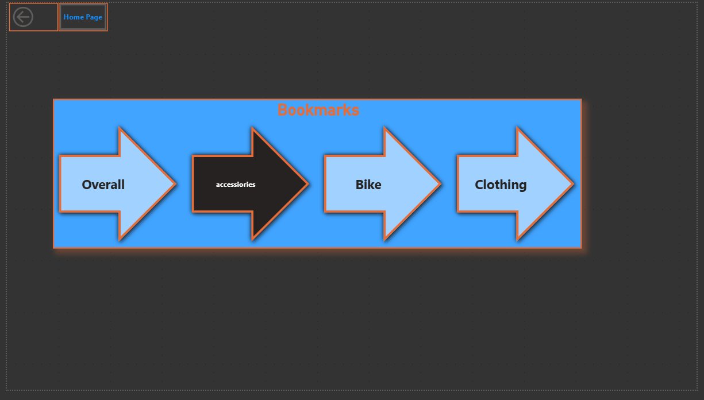

# 📈 Adventure Works Sales Analysis (Power BI)

[](dashboard/Adventure_Works_Sales_Analysis.pbix)
[](dashboard/Adventure_Works_Sales_Analysis.pbix)

## 📌 Project Overview
An interactive Power BI dashboard analyzing Adventure Works sales data across customers, products, categories, and regions — built with dynamic axis selection, bookmarks, and drill-through navigation.

---

## 🗂 Repository Structure
```
├── dashboard/     # The Power BI (.pbix) file
├── datasets/      # Source CSVs used to build the model
├── screenshots/   # Static previews of each dashboard page
├── demo/          # Animated GIF walkthroughs of the dashboard
└── README.md
```

---

## 🎬 Live Demo


---

## 🖥️ Dashboard Pages

### 🏠 Home Page
Navigation hub linking to all report pages.



### 👤 Customer Analysis
Revenue by top customer, gender-wise order distribution, and orders by annual income, with slicers for category, year, and gender.



### 📦 Product Analysis
Weekly product returns and weekly profit trends, with most profitable product/category and most ordered product called out.



### 🗂 Category Analysis
Return rate, revenue, sold quantity, and bulk orders broken down by category (Accessories, Bikes, Clothing), filterable by day type and year.



### 🌍 Maps
Country-wise order distribution shown geographically.



### 📊 Dynamic X-Axis / Y-Axis
Lets users swap the chart's X and Y axis fields on the fly (category, education level, gender, revenue, profit, and more).




### 📉 Dynamic Chart
Combined view showing Annual Income, Return Amount, Profit, Revenue, Sold Qty, Total Cost, and Total Orders by Gender and Education Level.



### 🔖 Bookmarks
Quick-jump buttons (Overall, Accessories, Bike, Clothing) for saved report views.



---

## 📊 Dataset
Source data used to build the model, found in [`datasets/`](datasets/):
- `AdventureWorks_Calendar.csv`
- `AdventureWorks_Customers.csv`
- `AdventureWorks_Products.csv`
- `AdventureWorks_Product_Categories.csv`
- `AdventureWorks_Product_Subcategories.csv`
- `AdventureWorks_Returns.csv`
- `AdventureWorks_Sales_2015.csv`
- `AdventureWorks_Sales_2016.csv`
- `AdventureWorks_Sales_2017.csv`
- `AdventureWorks_Territories.csv`

---

## 🛠️ Tools Used
- Power BI Desktop
- DAX (dynamic measures for axis switching)
- Power Query (data cleaning & modeling)

---

## 👤 Author
**Shubham Vishwakarma**
Aspiring Data Analyst | Power BI Enthusiast
